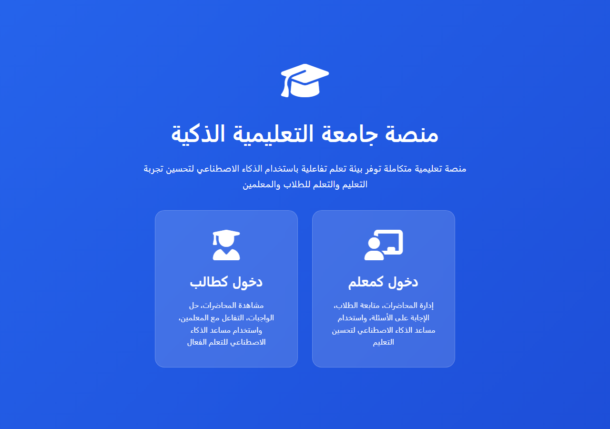
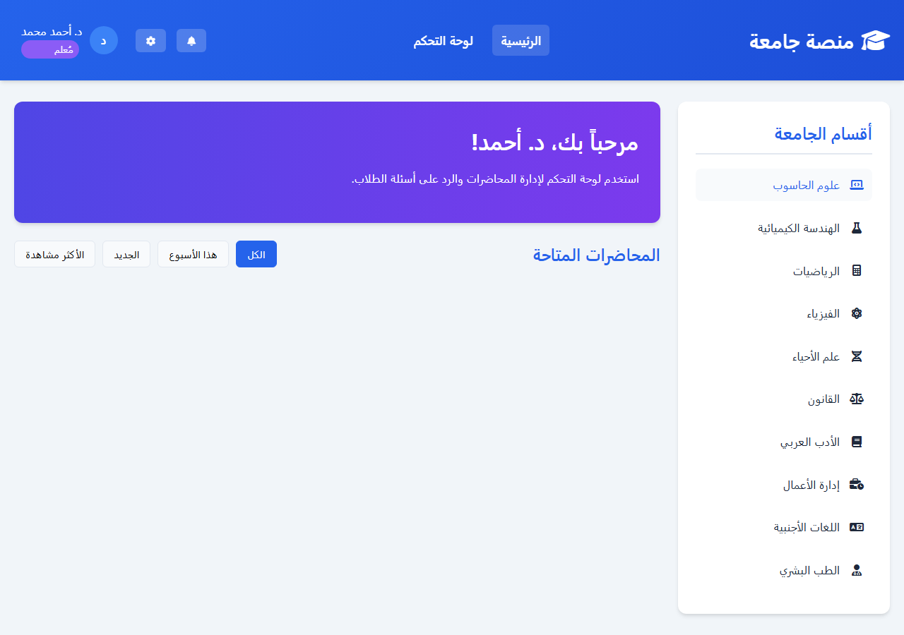
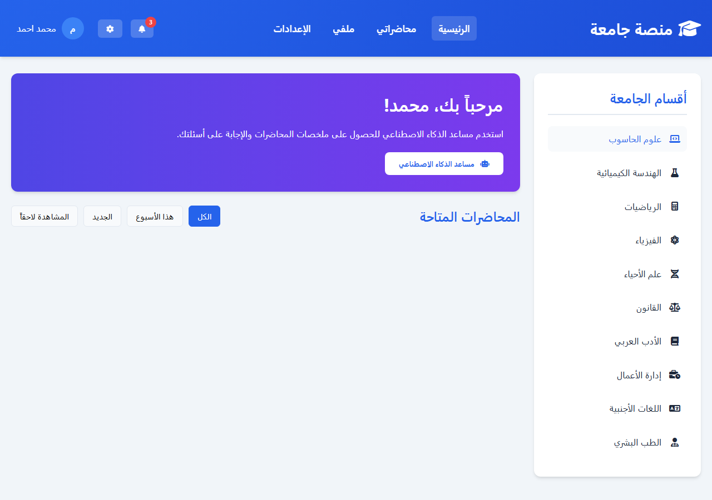
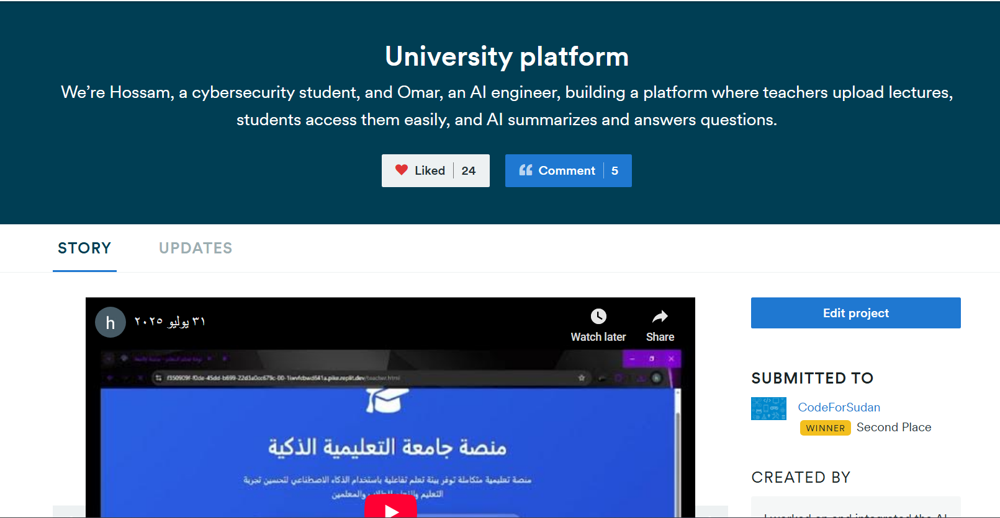
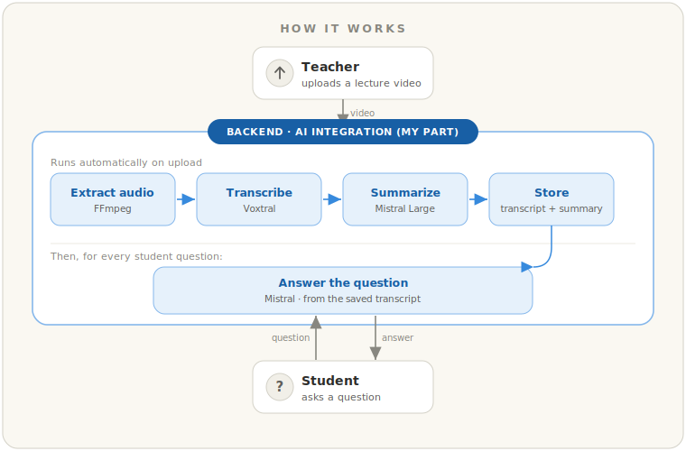

# Arabic AI Lecture Platform · منصة جامعة التعليمية الذكية

An Arabic (RTL) educational platform where teachers upload lecture videos and students get **AI-generated summaries** and a chat assistant that **answers questions from the lecture itself** — built on a speech-to-text + LLM pipeline.

> 🥈 **Second Place — [CodeForSudan](https://code-for-sudan.devpost.com/) Hackathon (Sep 2025), out of 299 participants.**
> 📺 [Devpost project](https://devpost.com/software/university-platform) · 🎥 [demo video](https://www.youtube.com/watch?v=jXVHAeHtcWc)

This was a **two-person hackathon project**. I — **Omar Althobaiti** — led the **AI integration**: the FFmpeg → Voxtral → Mistral pipeline (transcription, summarization, and grounded Q&A). **Hossam** built the platform UI (Figma) and the PHP front/back-end. This repository is published with that split credited.

---

## Demo

| Landing — pick a role | Teacher dashboard | Student dashboard |
|:---:|:---:|:---:|
|  |  |  |

🥈 Second place at the CodeForSudan hackathon:



🎥 **Full walkthrough:** [demo video](https://www.youtube.com/watch?v=jXVHAeHtcWc) · 📖 **Case study:** [docs/CASE-STUDY.md](docs/CASE-STUDY.md)

---

## What it does

- **Teachers upload lecture videos** through a dashboard; each lecture is stored with a processing status in a JSON record.
- **Audio → Arabic text:** on upload, the backend extracts audio with **FFmpeg** and transcribes it with **Mistral Voxtral** speech-to-text (with a model fallback chain).
- **Automatic Arabic summary** of every lecture, generated by `mistral-large-latest`.
- **Grounded Q&A:** students open a lecture and ask questions in a chat; answers are generated **only from that lecture's transcript** (low temperature, "don't add outside information") to keep responses faithful to the material.
- **Arabic-first output:** a cleanup layer rewrites LaTeX / English math notation into spoken Arabic (e.g. `∫` → "تكامل", `x²` → "س تربيع") so answers read naturally for students.
- Two roles (teacher / student) with a full **RTL Arabic** interface.

## How it works



_The backend AI pipeline above — FFmpeg + Voxtral + Mistral — is my contribution; Hossam built the UI and the rest of the platform._

## Tech stack

| Layer | Used |
|---|---|
| Frontend | HTML, CSS, vanilla JavaScript (RTL Arabic) |
| Backend | PHP (built-in server, no framework) |
| AI | Mistral API — **Voxtral** (`voxtral-mini-2507`, fallback `whisper-large-v3`) for STT; `mistral-large-latest` for summary + Q&A |
| Media | FFmpeg (audio extraction) |
| Prototype | Python 3 (`requests`) — standalone CLI version of the pipeline |
| Storage | Flat JSON files |
| Design / build | Figma · prototyped on Replit |

## Repository layout

```
app/                     The platform (runnable)
  index/teacher/student.html, assets/, *.php, voxtral_integration.js
  lecture_transcripts/lecture_1.sample.json   redacted sample output
ai-prototype/            Standalone AI pipeline (transcribe_and_qa.py)
docs/CASE-STUDY.md       Written case study (text + images)
screenshots/             Images used above
```

## Setup & run

**Prerequisites:** PHP 8+ (with `curl`, `mbstring`, `openssl`, `fileinfo`), **FFmpeg** on your PATH, and a **Mistral API key** (free tier at <https://console.mistral.ai>). Python 3 only if you want to run the prototype.

**1. Provide your API key** (read from the environment — nothing is hard-coded):

```bash
# macOS / Linux
export AI_API_KEY="your_mistral_key"
```
```powershell
# Windows PowerShell
$env:AI_API_KEY = "your_mistral_key"
```

**2. Run the platform:**

```bash
cd app
php -c custom-php.ini -S localhost:8000
```
Open <http://localhost:8000>. (Visit `/check_system.php` for a quick environment check — PHP extensions, FFmpeg, API reachability.)

**3. (Optional) Run the standalone AI prototype:**

```bash
cd ai-prototype
pip install -r requirements.txt      # plus FFmpeg installed on the system
python transcribe_and_qa.py          # prompts for a video path, then lets you ask questions
```

## What's not included

This repo has **all the source code**, but a few things are deliberately left out:

- **The API key** — purged from every file; supply your own via `AI_API_KEY`.
- **The lecture videos** — the demo content was a third-party YouTube calculus lesson, so it isn't ours to redistribute (and the files run to hundreds of MB, past GitHub's limits). The `app/video/` folder ships empty.
- **The full transcript** — replaced with a short **redacted sample** (`app/lecture_transcripts/lecture_1.sample.json`) so you can see the *shape* of the pipeline's output without republishing someone else's lecture.

Everything else — the upload flow, the FFmpeg/Voxtral/Mistral pipeline, the grounded Q&A service, both interfaces, and the Python prototype — is here and runs with your own key and any video.

## What I'd improve next

- **Real data layer & auth.** The "database" is flat JSON and there's no real authentication — I'd move to a proper DB with accounts and sessions.
- **Backend hardening.** The key is now env-based, but I'd also sanitize the upload path (it shells out to FFmpeg), tighten the currently-open CORS, and validate inputs server-side.
- **Background processing.** Transcription runs inline and blocks the upload request; I'd move it to a job queue with real progress in the UI — and, to scale past one transcript per request, swap context-stuffing for embeddings-based retrieval.

---

**Credits:** Omar Althobaiti (AI integration) · Hossam (platform, UI, PHP front/back-end).
**License:** [MIT](LICENSE).
