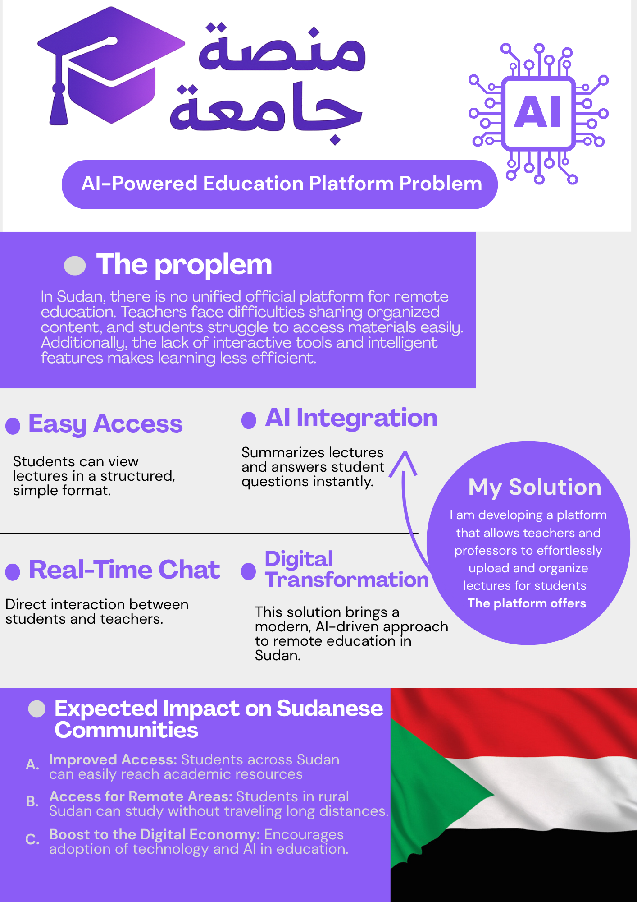
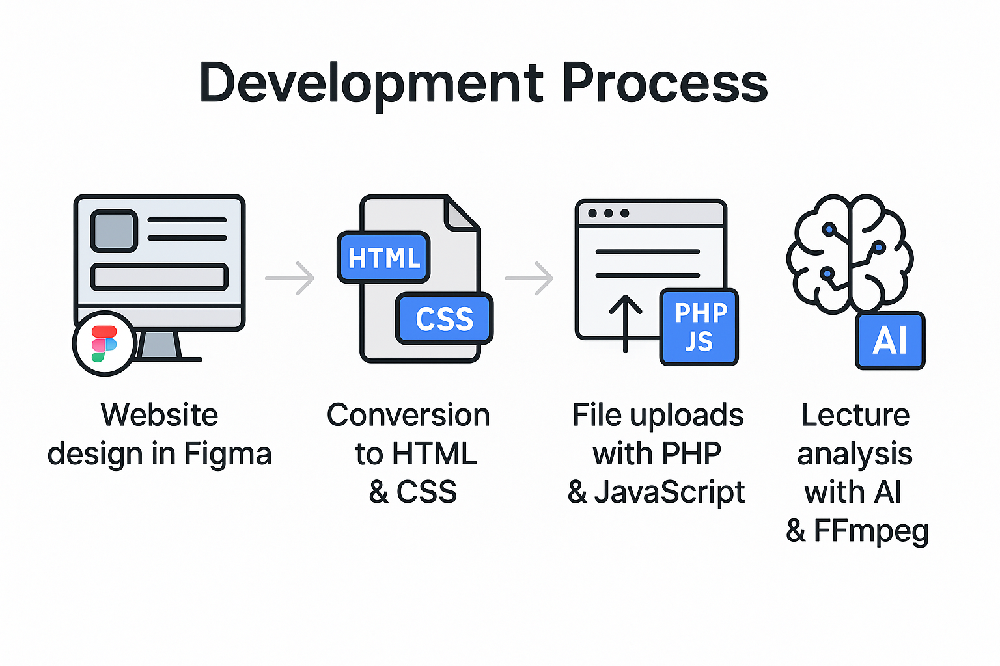

# Case Study — Arabic AI Lecture Platform

> 🥈 Second place, [CodeForSudan](https://code-for-sudan.devpost.com/) hackathon (Sep 2025) · 299 participants · [Devpost](https://devpost.com/software/university-platform) · [demo video](https://www.youtube.com/watch?v=jXVHAeHtcWc)

A two-person project: **Omar Althobaiti** (AI integration) and **Hossam** (platform & UI).

## The problem

Many universities — especially across Sudan — moved to remote learning without a dedicated platform, sharing lectures over Zoom, Telegram, and WhatsApp groups. Recorded lectures are long video files: a student can't search inside them or get a quick answer to a specific question.

## What we built

One platform with two roles:

- **Teachers** upload lecture videos to a single organized place.
- **Students** browse lectures and, for any lecture, ask an AI assistant questions answered from that lecture's content — alongside an auto-generated summary.

## The AI pipeline (my part)

When a teacher uploads a video, the backend:

1. **Extracts audio** with FFmpeg (16 kHz mp3).
2. **Transcribes** the Arabic speech with Mistral **Voxtral** (`voxtral-mini-2507`, with a fallback chain through other models).
3. **Cleans the text** — a layer rewrites LaTeX and English math notation into spoken Arabic (e.g. `∫` → "تكامل", `x²` → "س تربيع") so it reads naturally for students.
4. **Summarizes** the lecture with `mistral-large-latest`.

When a student asks a question, the transcript is passed in as context and the model is instructed to answer **only** from the lecture — low temperature, no outside information — so answers stay faithful to what the teacher actually taught.

## Architecture

- **Frontend:** HTML / CSS / vanilla JavaScript, RTL Arabic (teacher + student dashboards).
- **Backend:** PHP endpoints for upload, listing, deletion, and the AI service.
- **Storage:** lecture metadata and generated transcripts as JSON files.
- **External:** Mistral API (Voxtral + Mistral Large) and FFmpeg.

| Teacher dashboard | Student dashboard |
|:---:|:---:|
|  |  |

## What I'd improve next

- A real database and authentication instead of flat JSON files.
- Background processing for transcription so large uploads don't block the request.
- Embeddings-based retrieval so the assistant scales beyond one transcript per request.

---
Credits: Omar Althobaiti (AI integration) · Hossam (platform, UI, PHP front/back-end). · License: MIT.
